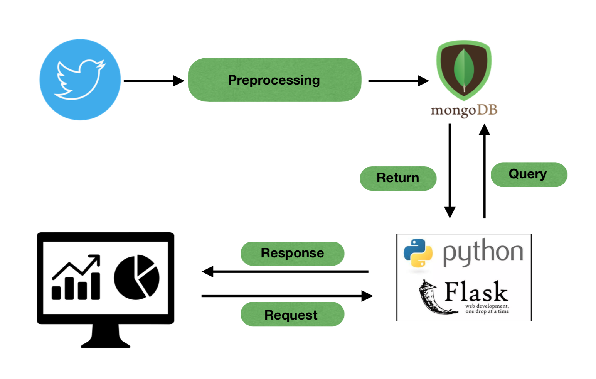
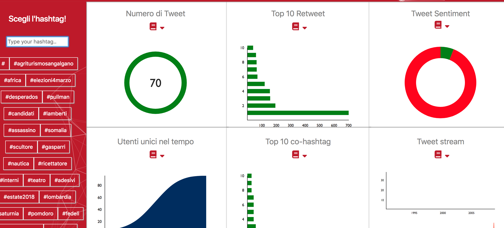

# Monitoraggio Twitter per la Pubblica Amministrazione

## Introduzione
L'applicazione consiste in una dashboard che mostra delle informazioni statistiche rispetto ad hashtag e topi dei Tweet raccolti.

La struttura del progetto può essere racchiusa nella seguente immagine:


In particolare, 

1. __Collezioniamo__ i Tweet tramite un collettore definito da un insieme di hashtag/account di interesse
2. __Preprocessiamo__ i Tweet prima di salvarli in MongoDB
3. Sviluppo del backend (Flask, Python) per rispondere alle __richieste__ fatte dal client
4. Il __client__ è sviluppato utilizzando React con [Create React App](https://github.com/facebook/create-react-app).

### 1. Collettore
L'applicazione è stata sviluppata con l'intenzione di permettere alle singole PA un collettore che faccia riferimento agli hashtag/account che si desidera monitorare. 

In [questo](https://github.com/CriMenghini/daf-monitopa/blob/production/streamer/Twitter%20Streaming.ipynb) IPython Notebook, riportiamo l'esempio di un collettore. 

__N.B.__ Nel file viene mostrato anche come inserire il singolo tweet nel DB. Rispetto la figura, di cui sopra, non viene compiuta la fase di preprocessing.

*Al momento il prototipo dell'applicazione fa riferimeto ad un insieme statico di Tweet collezionati in breve tempo per sviluppare l'applicazione stessa.*

### 2. Pre-processing

La fase di preprocessing del singolo Tweet consiste nel definirlo come un oggetto con delle proprietà. Nella fattispecie, una volta collezionato, il Tweet ha delle proprietà fisse (come l'autore, l'id, etc..) e alcune variabili (ad esempio il numero di retweet). Pertanto, seppur ancora assente la connessione tra dati e DB, l'applicazione è stata sviluppata in modo che la transizione ad un sistema di storage sia il più smooth possibile.

Al termine della face di preprocessing all'interno del DB viene conservato un oggetto come quello che segue:

```			        
{'changable_attributes': {'list_user_retweet': [], 
							   'num_retweet': 0},
 'data_retweet': 'Tue Mar 06 12:05:00 +0000 2018',
 'data_tweet': 'Tue Mar 06 12:05:00 +0000 2018',
 'id_retweet': 970993648392220672,
 'id_tweet': 970993648392220672,
 'is_a_retweet': False,
 'list_hashtags': ['aria','5marzo'],
 'vectorized_text': [12195,12356],
 'num_retweet': 0,
 'padding': array([12195,     0]),
 'sentiment': 'negative',
 'tweet_text': "Qualità dell'#aria: i dati rilevati il #5marzo in #Toscana https://t.co/cbJg98X2ID #ambiente #inquinamento #smog",
 'user_info': {'followers_count': 5781, 'name': 'ARPAT'},
 'user_tweet_id': 461049017}
```

Per l'aggiornamento di alcune proprietà, si esegue una query per verificare se il Tweet è già nel DB e richiede quindi l'update. La classe è definita [qui](https://github.com/CriMenghini/daf-monitopa/blob/production/src/classes.py) con il nome `Tweet`.

Invece, per quanto riguarda il Sentiment del tweet è stato costruito un modello, non perfezionato, che potete controllare da [qui](https://github.com/teamdigitale/pa-in-ascolto/blob/master/cri/notebooks/tweet_2016_preproc_and_model.ipynb). Nella stessa repository si trovano anche altri modelli. La sfida, in termini di Sentiment Analysis, sta nel fatto che i tweet che utilizziamo sono in italiano e la dimensione del groundtruth non è elevata.

### 3. Responses
Tramite interfaccia l'utente può compiere delle scelte e decidere cosa visualizzare. In base alle sue scelte, il server effettua delle operazioni. 

In primo luogo distinguiamo le due tipologie di analisi che l'utente può fare:

* In base all'__hashtag__
* Rispetto al __topic__

#### Hashtag
L'analisi tramite hashtag consiste nel visualizzare dei grafici relativi esclusivamente all'hashtag individuato.

Anche gli [hashtag](https://github.com/CriMenghini/daf-monitopa/blob/production/src/classes.py) vengono definiti come oggetti dalle seguenti proprietà (`Hashtag`):

```
{'hashtag': 'renzi',
 'lista_tweet': ([<__main__.Tweet at 0x11fe98c18>,
   <__main__.Tweet at 0x11fe96588>,
   <__main__.Tweet at 0x11fe96e10>],
  [970540855307198466,
   970729807272136705,
   970956245535510528]),
 'lista_user': [(3398885945, 'Mon Mar 05 06:05:46 +0000 2018'),
  (1566553698, 'Mon Mar 05 18:36:35 +0000 2018'),
  (3096871079, 'Tue Mar 06 09:36:23 +0000 2018')]
 
```


__N.B.__ I numeri mostrati dalla dashboard non rappresentano la totalità dei Tweet postati contenenti l'hashtag di interesse. Pertanto, per trarre conclusioni bisogna essere cauti. Certamente, le informazioni che si visualizzano possono dare un'idea di come un certo argomento è affrontato su Twitter.

#### Topic
Definiamo un topic come un insieme di hashtag tra loro pertinenti. Quindi per arrivare a definire questi insiemi di hashtag ci muoviamo in questo modo.

Costruiamo un grafo i cui nodi sono gli hashtag. Due hashtag sono tra loro connessi se co-occorrono in uno stesso tweet. Quindi, partendo dall'assunzione che gli hashtag presenti in un tweet siano tra loro attinenti, si vuole sfruttare la rete degli hashtag per identificare i topic, che prendono il nome dell'hashtag più ricorrente nel gruppo. 

Per raggruppare gli hashtag procediamo:

1. Proiezione della matrice delle adiacenze nello spazio delle componenti principali che descrivono il 90% della varianza del fenomeno
2. K-Means per aggregare gli hashtag (la scelta del numero di cluster è fatta utilizzando la tecnica presentata da [[1]](https://ieeexplore.ieee.org/document/5961514/))

Una volta identificati i cluster di hashtag, ogni tweet è assegnato ai cluster cui gli hashtag che contiene appartengono. Quindi ogni tweet puà appartenere a più topic. Nonostante questo ci aspettiamo che il numero di topic cui un tweet appartiene non sia elevato (*in generale un tweet non contiene tanti hashtag*), in più vorrebbe dire che di fatti l'algoritmo che utilizziamo tende a mettere in uno stesso topic gli hashtag che co-occorrono - come desiderato.

La tecnica usata potrebbe essere sostituita dal *clustering spettrale* sui grafi. In particolare, si calcolano gli autovettori corrispondenti agli *N* autovalori più piccoli e si utilizzano questi per procedere con l'algoritmo di clustering.

### 4. Il client
Riportiamo qui sotto un esempio della dashboard.



L'utente può digitare l'hashtag di interesse (non necessariamente visibile tra le opzioni) e avrà le seguenti informazioni:

1. *Numero di tweet*: il numero di tweet, escludendo i retweet, che contengono l'hashtag
2. *Top 10 retweet*: il grafico mostra a partire dal basso i tweet che hanno riscosso maggior successo
3. *Tweet Sentiment*: La percentuale di tweet con sentiment negatico e positivo
4. *Utenti unici nel tempo*: corrisponde alla somma cumulata di utenti unici che twittano relativamente all'hashtag/topic
5. *Top 10 co-hashtag*: l'elenco di hashtag che co-occorrono più frequentemente
6. *Tweet Stream*: il flusso dei tweet

## Esegui l'App in locale

Per eseguire l'applicazione:

1. Scaricare la repository (branch: `production`)
2. Assicurarsi di avere istallati sul proprio pc i requisiti contenuti in [`requirements.txt`](https://github.com/CriMenghini/daf-monitopa/blob/master/requirements.txt)
3. Aprire un terminale, posizionarsi nella cartella `daf-monitopa` ed eseguire il comando:
	
	```
	$ ipython server.py
	```
4. In un altro terminale, posizionarsi in `daf-monitopa/web-ui` ed eseguire:

	```
	$ npm i
	$ npm start
	```

## Prova l'App

A breve inseriremo il link per vedere il prototipo funzionante dell'applicazione.

## Leggi sul progetto

Il progetto, sviluppato dal [Team Digitale](https://teamdigitale.governo.it/) in collaborazione con la Regione Toscana, è descritto in modo meno tecnico in [questo](https://dataportal-private.daf.teamdigitale.it/#/userstory/list/6095a70d-61f8-4618-a42f-c9ccf1fd02f1) post.